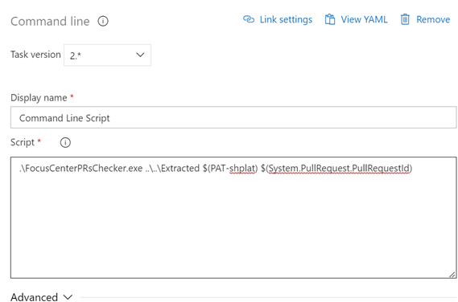
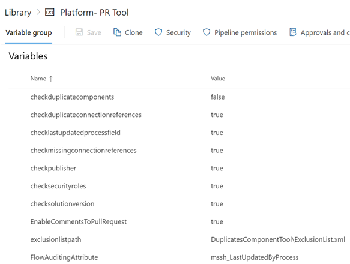
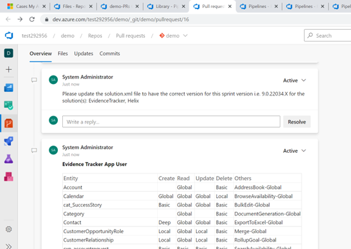
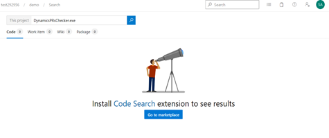
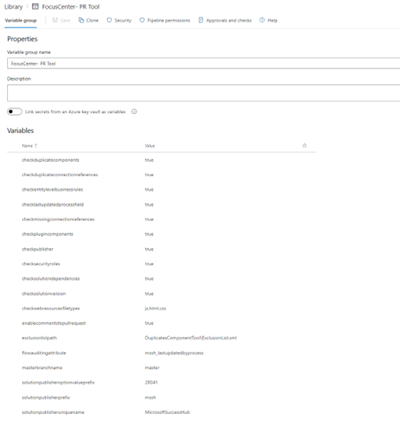
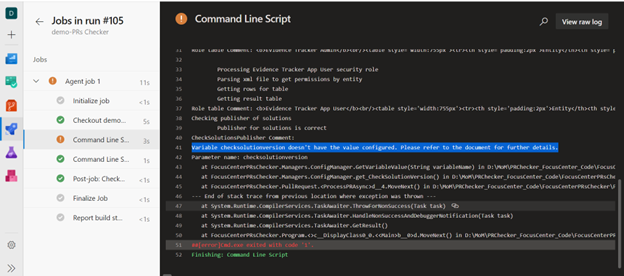
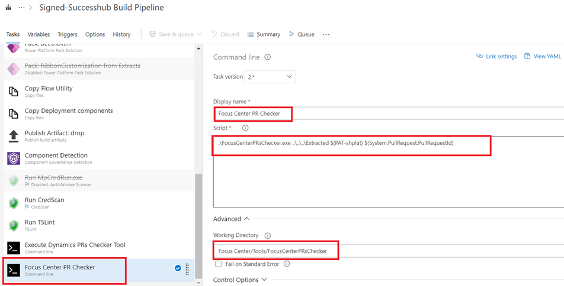
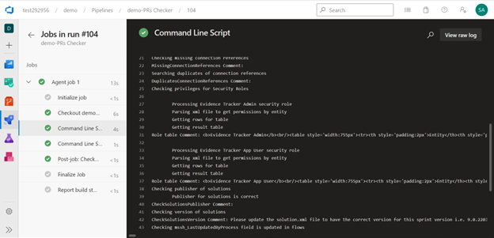
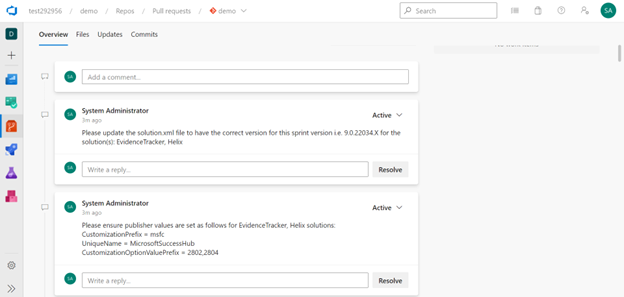

# Contents {#contents .TOC-Heading}

[Introduction]

[Components and functionality]

[Pre-requisites]

[Setup]

[Configuration]

# Introduction

Every development team reviews PR to check key attributes to ensure that the PR is adhering to standards. Some of the checks are routine and important. Automating routine checks will improve efficiency and improve quality of builds.

PR checker tool is one such tool which will automate the routine checks and post comments on PR. Validating solution publishers and solution versions are a few automated checks in the tool.

# Components and functionality

## Components

PR Checker Tool consist of four components:

1.  tool's exe,
2.  tool's app config,
3.  pipeline variable group
4.  command line script.





Users will see review comments from PR checker tool on their respective PRs.



## Functionality

The PR checker currently has the following features:

1.  **Check duplicate components**: Checks if a component is present across multiple solutions in the repo. This way a particular component is not customized in multiple solutions by mistake. It will also ensure clear ownership of components in a solution and prevent overwriting of customizations in Test/Prod environments.

2.  **Check duplicate connection references**: Check if any connection references is present across multiple solutions in the repo.

4.  **Check lastupdated process field**: This is a custom field that needs to contain the flow name in Dataverse Create/Update actions. This check was built when multiple flows were updating the same tables/records and the users/devs having trouble identifying the flow that made the updates.

    a.  **Flow auditing attribute**: The name of the attribute which would be traced in all the Dataverse Create/Update actions of flow. This attribute is needed for record auditing purposes in the Environment.

5.  **Check missing connection references**: Checks if any connection references are missing in the solution in the repo but are referenced in flows.

6.  **Check publisher**: This rule ensures publisher values are consistent in the org. The configurable values are provided in solutionpublisherprefix, solutionpublisheruniquename, solutionpublisheroptionvalueprefix variables.

7.  **Check security roles**: This rule logs role permissions in the PR as comments in an easy-to-read tabular format.

9.  **Check solution version**: Check if solution version is incremented compared to the solution version from the master branch.

11. **Enable comments to pull request**: Set this flag true to post comments to PR else comments will be added to only console.

12. **Exclusion list path**: If a certain list of components, entities, folders, file extensions need to be excluded by the tool, then they should be added here.

13. **Solution publisher option value prefix**: This is comma separated string (without space) mentioning all allowed option value prefix.

14. **Solution publisher prefix**: Comma separated string (without space) mentioning all allowed publisher prefix.

15. **Solution publisher unique name**: Comma separated string (without space) mentioning all allowed publisher unique prefix.

# Pre-requisites

-   Create/Get personal access token (PAT) which will be used to authenticate into Azure DevOps. For more information, see [Personal access tokens (PAT)](https://docs.microsoft.com/en-us/azure/devops/organizations/accounts/use-personal-access-tokens-to-authenticate?view=azure-devops).

-   URL of organization in Azure DevOps.

-   For code searches, install **Code Search** **Extension** ([Code Search](https://marketplace.visualstudio.com/items?itemName=ms.vss-code-search)) from Marketplace extension. For more information, see [Functional code search]().


# Setup

PR Checker Tool is an application, for which the executable can be added to the repository and configured as mentioned in the sections below. In our repository it currently sits in a Tools folder.

Below files need to be added in your repository for PR Checker to work (see screenshot below):

-   ExclusionList.xml (DuplicatesComponentTool folder)
-   FocusCenterPRsChecker.exe
-   FocusCenterPRsChecker.exe.config
-   FocusCenterPRsChecker.pdb
-   Newtonsoft.Json.dll


# Configuration

Post solution import, we must follow steps given below.

1.  ### Create/update pipeline variable group

    1.  Sign in to your organization (https://dev.azure.com/{yourorganization}) and select your project.

    2.  Select **Pipelines \> Library \> | Variable group.**

    3.  Create variable group with name say "FocusCenter- PR Tool" and description for the group

    4.  Enter the following variables' name and value for each variable to include in the group, choosing | Add for each one.

    5.  When you\'re finished adding variables, select **Save**.


| Variable Name                      | Description                                                                                                                                                                                            | Values & Example                                        |
|------------------------------------|--------------------------------------------------------------------------------------------------------------------------------------------------------------------------------------------------------|---------------------------------------------------------|
| checkduplicatecomponents           | Check if any components are duplicate in solution.                                                                                                                                                     | true/false                                              |
| checkduplicateconnectionreferences | Check if any connection references are duplicate in solution.                                                                                                                                          | true/false                                              |
| checklastupdatedprocessfield       | Check if audit attribute is filled in flows having Dataverse Create/Update actions.                                                                                                                    | true/false                                              |
| checkmissingconnectionreferences   | Check if any connection references are missing in solution.                                                                                                                                            | true/false                                              |
| checkpublisher                     | To ensure publisher values are set as values provided in solutionpublisherprefix, solutionpublisheruniquename, solutionpublisheroptionvalueprefix                                                      | true/false                                              |
| checksecurityroles                 |                                                                                                                                                                                                        | true/false                                              |
| checksolutiondependencies          | List new dependencies added in the PR/commit on the solutions that exist in the repository.                                                                                                            | true/false                                              |
| checksolutionversion               | Check if solution version is incremented compared to the solution version from the master branch.                                                                                                      | true/false                                              |
| enablecommentstopullrequest        | Set this flag true to post comments to PR else comments will be added to only console.                                                                                                                 | true/false                                              |
| exclusionlistpath                  | String path to the file which contains list of components, entities, folders, file extensions to be excluded.                                                                                          | For example: DuplicatesComponentTool\\ExclusionList.xml |
| flowauditingattribute              | String name of the attribute which would be traced in all the Dataverse Create/Update actions of flow. This attribute is needed for record auditing purposes in the Environment. Must be in lowercase. | For example: mssh_lastupdatedbyprocess                  |
| masterbranchname                   | Name of the master branch of the repository.                                                                                                                                                           | For example: master, develop                            |
| solutionpublisheroptionvalueprefix | Comma separated string (without space) mentioning all allowed option value prefix.                                                                                                                     | For example: 28042,28041                                |
| solutionpublisherprefix            | Comma separated string (without space) mentioning all allowed publisher prefix.                                                                                                                        | For example: msfc,mssh                                  |
| solutionpublisheruniquename        | Comma separated string (without space) mentioning all allowed publisher unique prefix.                                                                                                                 | For example: MicrosoftSuccessHub                        |
| solutionsrepopath                  | Path to solution folders in your repository.                                                                                                                                                           | For example: /Extracted/                                |

> 

6. Create another variable group say "FocusCenter- PR Tool PAT" and enable "**Link secrets from an Azure key vault**". For more information, see [Link secrets from an Azure key vault].

  |  Variable Name      | Description | Values & Example |
  | ------------------- | ----------- | ---------------- |
  | PAT-shplat          | PAT Token   |                  |

*Note: If any of above values are not set then tool will show below error.*



2.  ### Configure tool in pipeline

    1.  Use the variable groups created in *Pre-requisites Section*. Open your pipeline and select **Variables \> Variable groups**, and then choose **Link variable group**. Select the previous created groups.

    2.  In pipeline, add *command line* task (Run a command line script using Bash on Linux and macOS and cmd.exe on Windows).

    3.  Add *Display name.*

    4.  In the *Script* section, add:

        a.  Exe name

        b.  Relative path to solution repository

        c.  PAT variable name from pipeline variables

        d.  PullRequestId from system variables.

        *Note: Add the above values separated by space.*

        Example:

        ```.\\FocusCenterPRsChecker.exe ..\\..\\..\\Extracted \$(PAT-shplat) \$(System.PullRequest.PullRequestId)```

    5. Click on *Advanced* and add Path to exe in *Working Directory.*



## View of PR Checker Tool working on pipeline

Below is the view of PR Checker Tool working on pipeline.





  [Introduction]: #introduction
  [Components and functionality]: #components-and-functionality
  [Pre-requisites]: #pre-requisites
  [Setup]: #setup
  [Configuration]: #configuration
