# Contents

[Introduction]

[Components and functionality]

[Pre-requisites]

[Setup]

# Introduction

The PR Accelerator is a tool that allows Power Platform solution developers to commit changes and create Pull Requests in Azure DevOps repositories from the user-friendly UI without needing to install or understand local build tools or Microsoft Power Platform CLI.

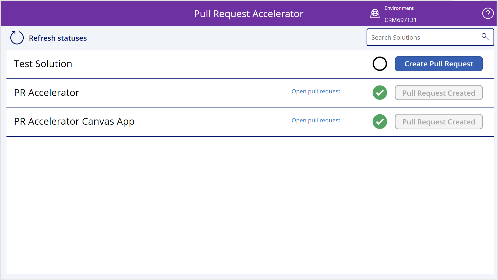

# Components and functionality

Overview of the PR Accelerator functionality:
1. Once users open the PR Accelerator app for the first time, they are asked to provide the required connections.
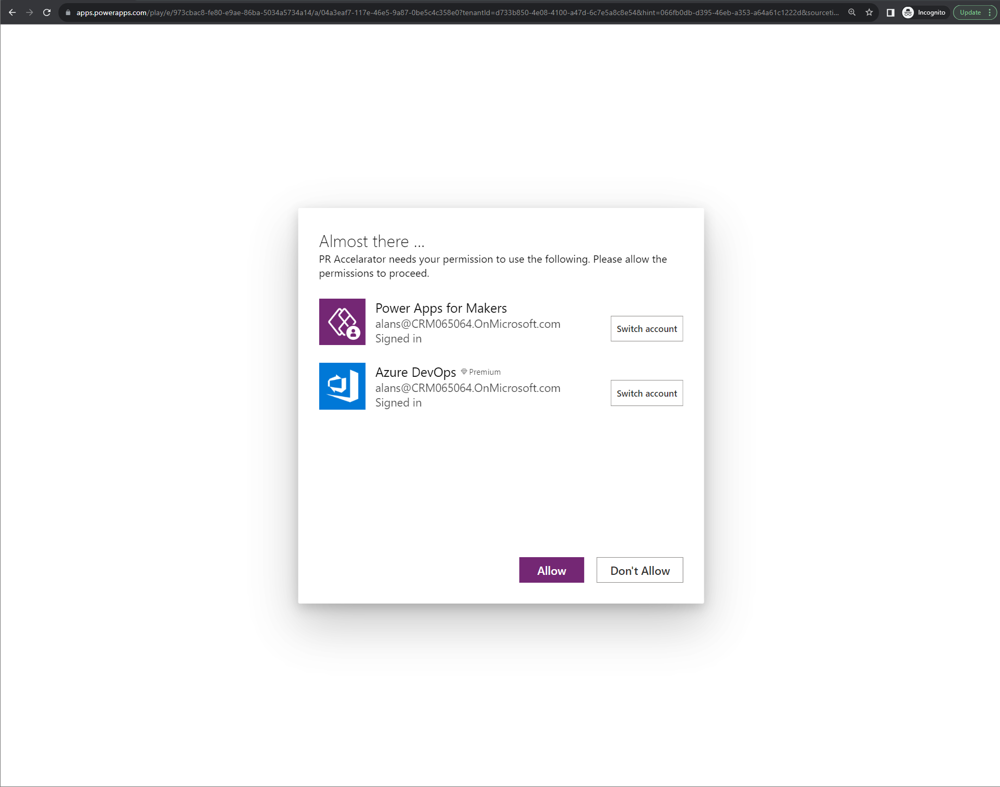
2. Once connections are provided and PR Accelerator app is opened, users can select the needed environment by clicking on the environment selector in the top right corner of the app.
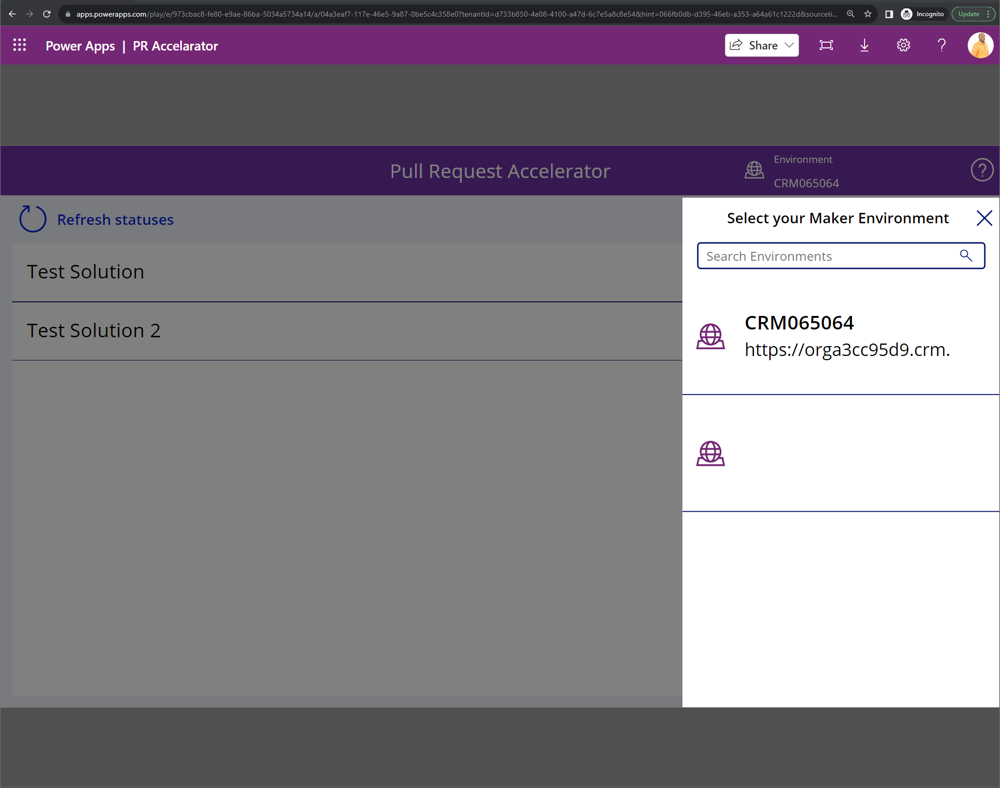
3. Once environment is selected, users can see the list of unmanaged solutions in the selected environment and create Pull Request for any of them simply by clicking "Create Pull Request" button. Once user starts creating Pull Request, status of the solution is changed to Processing, solution is exported from the selected environment and added to the configured repository.
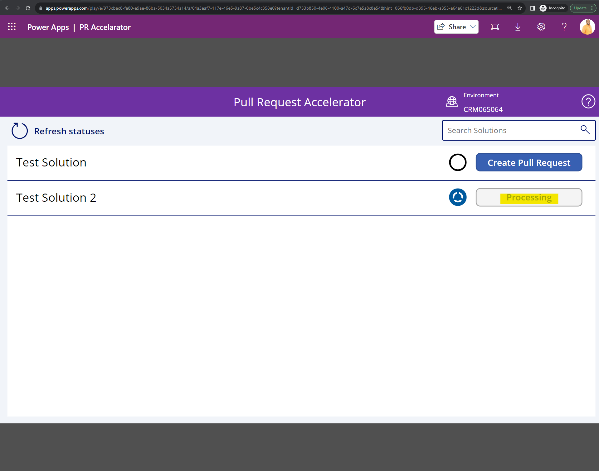
4. Once solution is added to repository and Pull Request is created, the user can see the successful status indicator and direct link to created Pull Request.
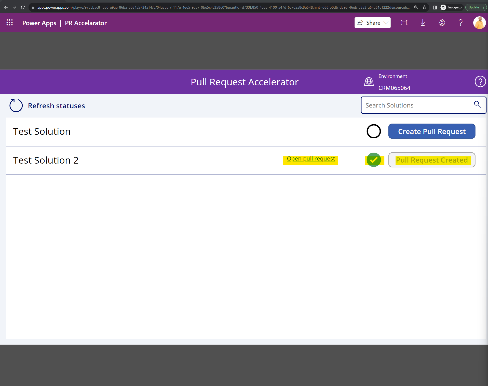
5. Users are also informed about the status of Pull Request creation via email notification.
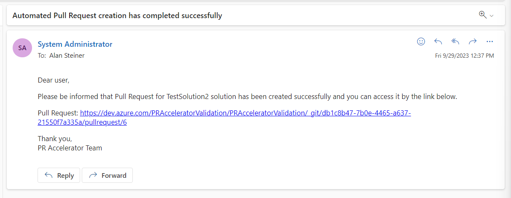
6. If Pull Request creation fails for any reason, users can see the unsucesfull status indicator and can retry PR creation from the app.  

PR Accelerator consists of the following components:
- PR Accelerator solution - contains canvas app and Power Automate flows for PR Accelerator tool.
- PR Accelerator Azure DevOps pipline for exporting solution from Power Platform environment and commiting it to the repository.

# Pre-requisites

- Create/Get personal access token (PAT) which will be used in Azure DevOps pipeline to commit solution files in your repository. PAT Token must have "Code (Read & write)" privileges. For more information, see [Personal access tokens (PAT)](https://docs.microsoft.com/en-us/azure/devops/organizations/accounts/use-personal-access-tokens-to-authenticate?view=azure-devops).
- Install Microsoft Power Platform Build Tools into your Azure DevOps organization from [Azure Marketplace](https://marketplace.visualstudio.com/items?itemName=microsoft-IsvExpTools.PowerPlatform-BuildTools). Power Platform specific Azure DevOps build tasks are used in Azure DEvOps pipeline to export solution from Power Platform environment.
- Enable **Third-party application access via OAuth** in your Azure DevOps organization for Power Platform solution to interact with it. To enable, sign in to your Azure DevOps organization (https://dev.azure.com/{yourorganization}), go to Organization Settings -> Policies and set "Third-party application access via OAuth" flag to yes.
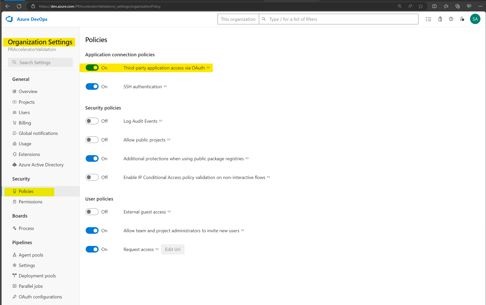

# Setup

## PR Accelerator Azure DevOps pipeline configuration

PR Accelerator Azure DevOps pipeline is responsible for extracting solution from Power Platform environment and commiting it to the repository branch which is later used to create Pull Request.

### Create Power Platform service connection

Fro PR Accelerator Azure DevOps pipeline to interact with the Microsoft Power Platform environment, you must create a service connection. 

To create service connection, go to Project settings of your Azure DevOps project -> Service connections.

1. If you want to use service account without multi-factor authentication, create Generic service connection with username and password. You can use any environment url as "Server URL" as it will be overriden in the pipeline later.
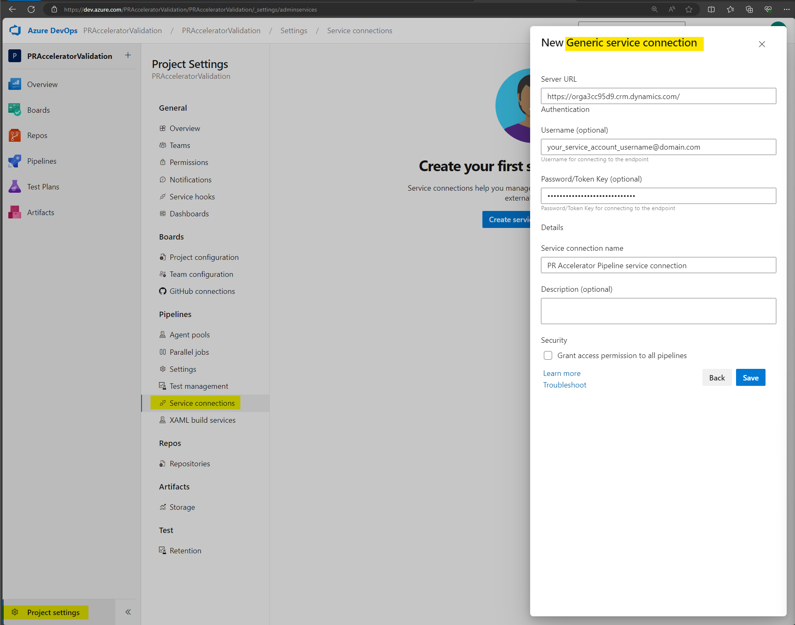
2. If you want to use service principal and application user for Microsoft Power Platform environment connection, create Power Platform service connection with Tenant Id, Application Id and client secret. You can use any environment url as "Server URL" as it will be overriden in the pipeline later.
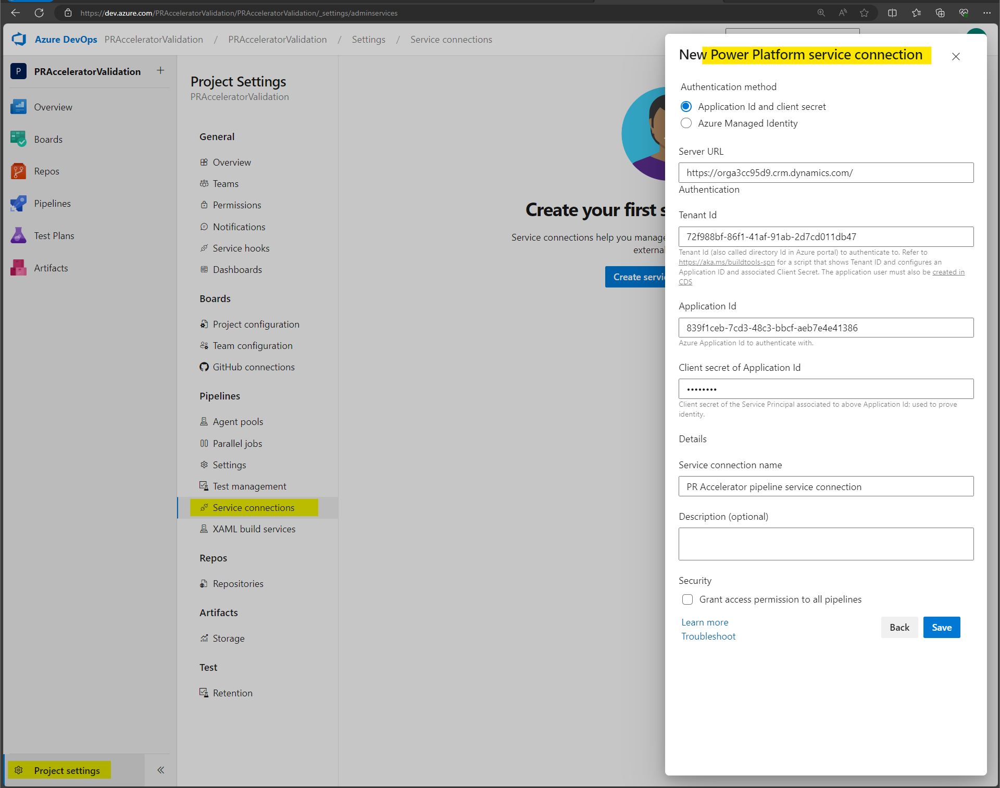

For more information on service connection creation, see docs [here](https://learn.microsoft.com/en-us/power-platform/alm/devops-build-tools#connection-to-environments).

> [!IMPORTANT]  
> Please make sure to add service account or service principal (application user) to all environments you want to export solutions and create Pull Request from and provide enough privileges to export solution (for example, assign System Administrator default Security Role to service/application user). 

Copy service connection id to use in the later steps. Service connection id can be obrained from the service connection URL (resourceId parameter).

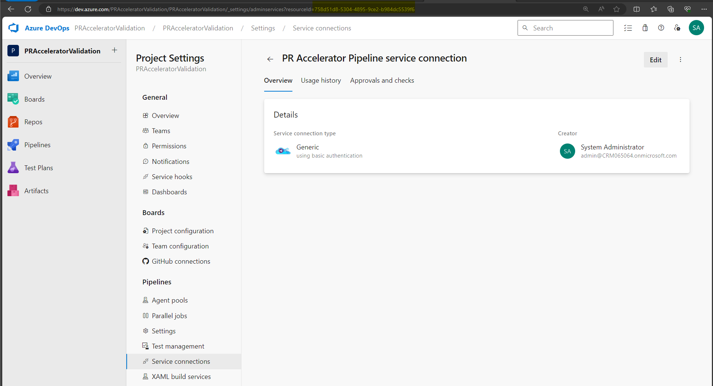

### Create PR Accelerator Azure DevOps pipeline

Please follow the steps below to configure PR Accelerator Azure DevOps pipeline.

1. Sign in to your Azure DevOps organization (https://dev.azure.com/{yourorganization}) and select your project.
2. Go to **Pipelines** and start creating new pipeline.
3. Select Azure Repos Git in the **Connect** tab.
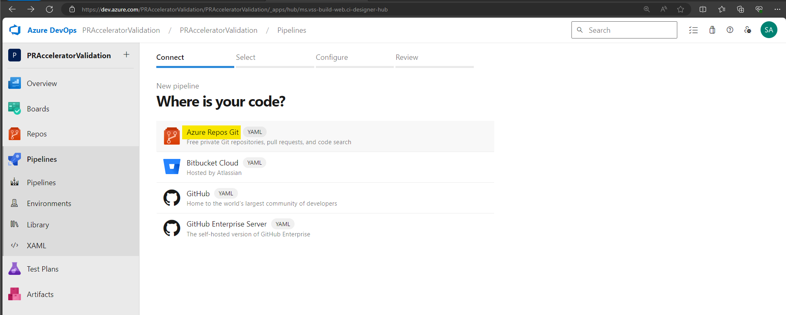
4. Select repository where you want to store solutions in the **Select** tab.
5. Select Starter pipeline template in the **Configure** tab.
6. Replace starter pipeline YAML definition with PR Accelerator pipeline definition from [PR Accelerator Pipeline.yml](PRAcceleratorPipeline.yml) file.
7. Replace the pool name on line 7 in the pipeline definition with the name of your Windows agent pool.
8. Configure variables.

  |  Variable Name  | Value | Keep this value secret | Let users override this value when running this pipeline |
  | ------------------- | ----------- | ---------------- | ---------------- |
  | AccessToken | PAT Token value created in [pre-requisites](#pre-requisites) steps | True | False |
  | BranchName |  | False | True |
  | BuildTools.EnvironmentUrl |  | False | True |
  | PowerPlatformServiceConnectionId | Power Platform service connection id copied in [Create Power Platform service connection](#create-power-platform-service-connection) | False | False |
  | SolutionName |  | False | True |
  | SolutionsFolderPath | Provide path to your solutions folder. For example, is you store solutions in the repository in the "Solutions" folder, set value to "`\Solutions\`". If you store solutions in the root of your repository, leave the value blank. | False | False |

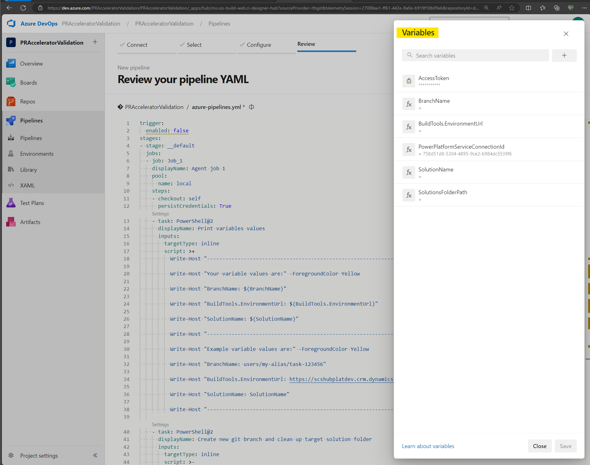

9. Save pipeline.
10. Give PR Accelerator pipeline permission to use service connection.
    1. Go to service connecxtion created in [Create Power Platform service connection](#create-power-platform-service-connection) step.
    2. Open Security settings.
    3. Add PR Accelerator pipeline as permitted pipeline in **Pipeline permissions** section.
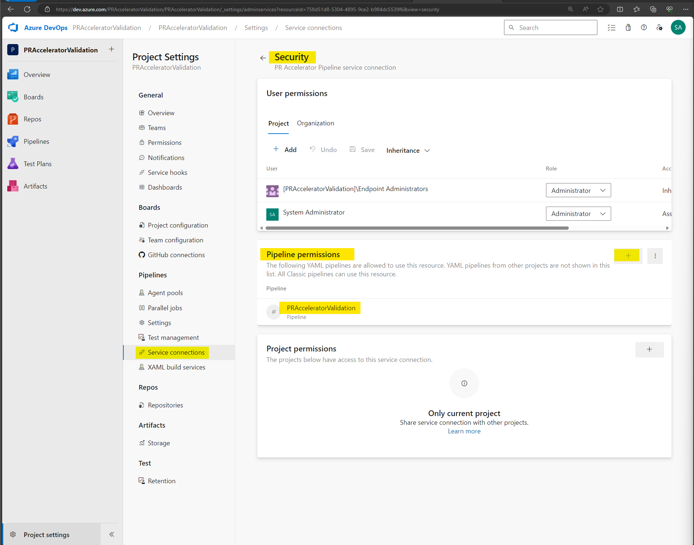

11. Give PR Accelerator pipeline permission to create branch and contribute to the repository. To configure these permissions, go to Project Settings -> Repositories -> Select neeeded repository -> Select Build Service user -> Allow "Contribute", "Contribute to pull request" and "Create branch" actions.
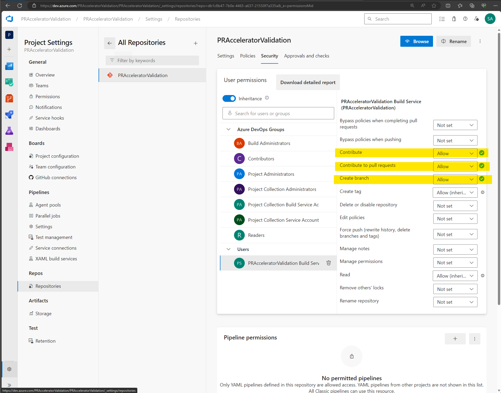

### PR Accelerator solution import and setup

1. Go to [https://make.powerapps.com/](https://make.powerapps.com/) and open your environment.
2. Select **Solutions** tab and start importing PRAccelerator solution. Use [PRAccelerator.zip](PRAccelerator.zip) to install unmanaged version of the solution and [PRAccelerator_managed.zip](PRAccelerator_managed.zip) for managed version.
3. During import provide connections for required Connection Reference. Create connections with the service account which has permissions to execute pipelines in your Azure DevOps organization and has System Administrator Security Role in your Power Platform environment.
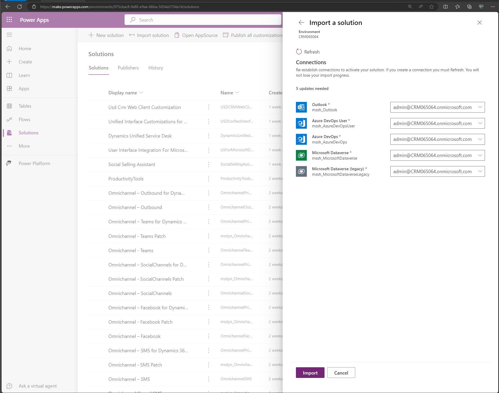
4. During import provide values for Environment Variables.
    - **Azure DevOps Organization Name** - the name of your organization in Azure DevOps
    - **Azure DevOps Repository Id** - if of your Azure DevOps repository where you store Power Platform solutions (respository id can be obtained from this api request to AzureDevops: `https://dev.azure.com/{organization}/{project}/_apis/git/repositories?api-version=6.1-preview.1`)
    - **Solutions Folder Name** - the name of the folder where you store Power Platform solutions in your Azure DevOps repository. If you store solutions in the root, set velue to `/`.
    - **Azure DevOps Repository Main Branch Name** - the name of the main branch of your Azure DevOps repository 
    - **Azure DevOps PR Accelerator Build Id** - the id of the build pipeline definition created in [Create PR Accelerator Azure DevOps pipeline](#create-pr-accelerator-azure-devops-pipeline) section that can be obtained from pipeline URL.
    - **Azure DevOps Project Name** - the name of your project in Azure DevOps 
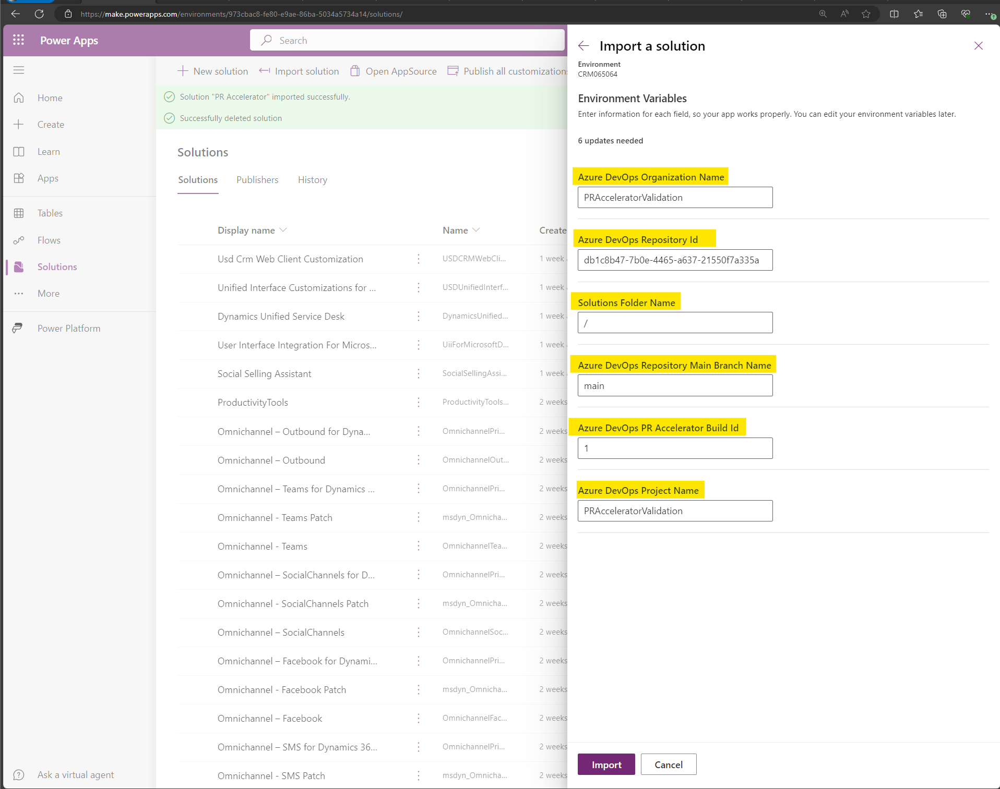
5. Once solution is imported and if you completed all the steps above and provided valid configuration, PR Accelerator canvas app should ready to use. Please remember to share the canvas app with the users and provide PR Accelerator User role when sharing the app. 
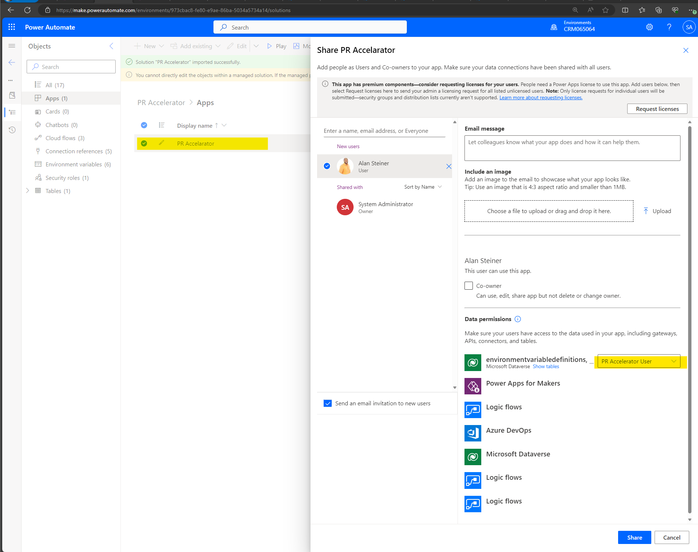

> [!IMPORTANT]  
> Please make sure to add PR Accelerator users to your Azure DevOps organization and project and give them contribute permissions to your Azure DevOps repository so that Pull Requests can be created under their name. To configure these permissions, go to Project Settings -> Repositories -> Select neeeded repository -> Select specific user or group and allow "Contribute" and "Contribute to pull request" actions.

  [Introduction]: #introduction
  [Components and functionality]: #components-and-functionality
  [Pre-requisites]: #pre-requisites
  [Setup]: #setup
